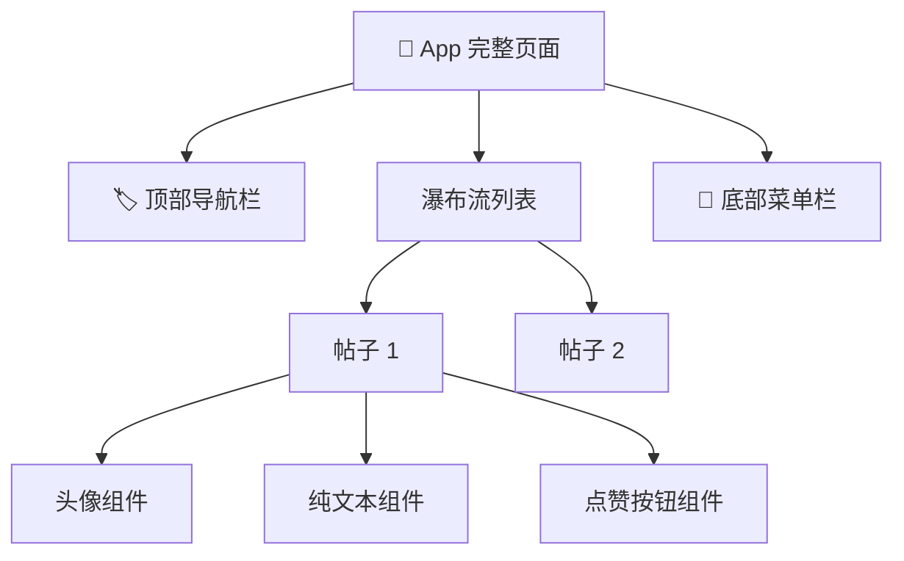
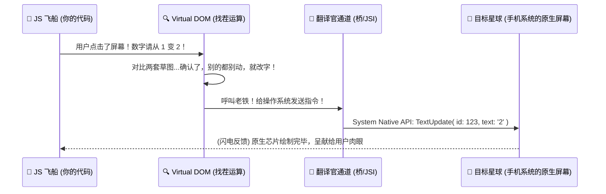
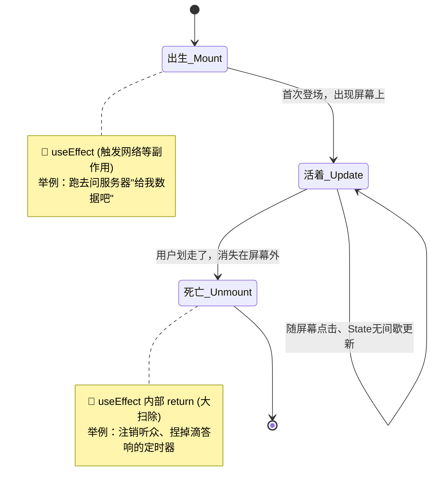

# 📖 React Native 组件与核心原理 (通俗易懂版)

> [!TIP]
> 别把 React Native 想得太复杂！它本质上就是一个**“贴身翻译官”**。你用简单轻巧的语言 (JavaScript 和 React) 写下“页面该长什么样”，它负责帮你翻译成 iOS 和 Android 手机真正能懂的“机器语言”，然后呈现给用户。

---

## 1. 什么是“组件” (Component)？—— 就像玩乐高

在 React Native 中，**万物皆组件**。如果把一个 App 页面比作一座城堡，那组件就是搭城堡的**乐高积木**。

- **小积木（基础组件）**：自带的零件，比如一块原生的文字 `<Text>`，一个原生图片 `<Image>`。
- **大积木（自定义组件）**：你把文本和图片拼在一起，做成了一个漂亮的“用户头像卡片”，这就成了你自己独创的大积木 `<UserProfile>`。

### 🧩 组件的组合魔力



**为什么大家都喜欢这么干？** 答案是：一次搭建，到处使用！你辛辛苦苦调解好的“点赞按钮”，可以直接搬到整个项目的各个角落反复使用，这就是开发中常说的**“高度可复用性”**。

---

## 2. 声明式开发 —— “点外卖” vs “指导新手做饭”

传统的原生手机界面开发（早期 iOS/Android 原生），通常是**命令式**的，就像**指导新手做饭**：
> “你先去超市买西红柿，然后回来切了，起锅烧油把鸡蛋倒进去，翻面两遍，再倒入西红柿...” 
> （步骤极度繁琐，漏了一步程序就会崩溃卡死）

React 的开发方式是**声明式**的，就像**打开外卖软件点外卖**：
> “老板，我要一份西红柿炒鸡蛋盖饭，不要葱，加辣。”
> （你只管声明出你想要的最终结果，React 内部和原生框架负责帮你算好一切并做出来）


---

## 3. 组件的两件法宝：Props (基因) 与 State (记忆)

怎么让冷冰冰的组件随着用户的点击动起来？全靠这俩兄弟：`Props` 和 `State`。

| 概念 | 把它想象人类的... | 特点 | 谁来控制？ |
| :--- | :--- | :--- | :--- |
| **Props** (属性) | **🧬 基因 / 父母的遗传** | **只读不能随意乱改**。组件出生时就带有的属性，比如眼睛的颜色、你的身高，你自己很难改掉。 | 父组件（也就是外部调用者） |
| **State** (状态) | **🧠 今日心情 / 随身日记** | **随时记随时改**。一旦心情一变，组件就会大换装重新展示。比如你饿了（State 改变），表现出来的就是皱眉头（UI 重新渲染）。 | 组件自己（内部独立自己管理） |

### 💻 极简代码演示：点赞按钮的“前世今生”

让我们看看代码里它们是怎么合作的：

```tsx
import React, { useState } from 'react';
import { View, Text, TouchableOpacity } from 'react-native';

// 这里的 title 就是 Props（外部给的标题，就像父母给的名字，不可修改）
const LikeButton = ({ title }) => {
  // 这里的 likes 就是 State（自己的记忆，被点了几次自己默默记在心里，可以随意修改更新）
  const [likes, setLikes] = useState(0);

  return (
    <View style={{ padding: 20, alignItems: 'center' }}>
      {/* 1. 展示基因：外面的名字老老实实展示出来就行了 */}
      <Text style={{ fontSize: 20, fontWeight: 'bold' }}>{title}</Text>
      
      {/* 2. 改变记忆：当手指点击 (onPress) 时，把 likes 记忆加 1。React 察觉到了，就会帮你换上新的 UI！ */}
      <TouchableOpacity 
        style={{ backgroundColor: '#ff5c5c', padding: 12, marginTop: 10, borderRadius: 8 }}
        onPress={() => setLikes(likes + 1)} 
      >
        <Text style={{ color: 'white', fontSize: 16 }}>❤️ 给这篇文章点赞 ({likes})</Text>
      </TouchableOpacity>
    </View>
  );
};

export default LikeButton;
```

---

## 4. 魔法是怎么产生的？(底层原理解密)

你在 JS 里写的 `<Text>` 文字组件、`<View>` 容器，手机操作系统本身其实是**完全不认识的**。手机（iOS/Android）只认识自己原生的原生控件 (比如 iOS 里的 `UILabel`、安卓里的 `TextView`)。

这中间到底发生了什么隐秘操作？

### 🔨 步骤一：画草图 (Virtual DOM)
当数据（State）变了，React 不会傻乎乎地立刻去重新刷新一整个手机屏幕（太卡了）。
它会先在极快的虚拟内存里偷偷画一张当前的“UI设计草稿”（即 **Virtual DOM**）。
然后，它会玩一个叫做 **Diff (找茬游戏)** 的算法，对比“前一秒的旧图”和“这一秒的新图”，**精准找出不同的地方**（比如上百万像素的页面里，它神奇地算出了只有点赞数字从 1 变成了 2）。

### 🔨 步骤二：跨频道传话 (桥接 Bridge)
找出了那唯一的一处变化后，React 需要把这个指令跨洋过海发给真正的手机底层。



---

## 5. 架构大升级：告别“独木桥”，拥抱“传送门”

React Native 这个翻译官通讯系统，正在经历一次史诗级的基建大升级：

- 🚣 **旧架构 (Bridge 异步独木桥时代)**
  > 以前，JS 大脑和原生手机之间隔着一条大裂谷。想让屏幕变色，必须把文字打包成一种叫做 JSON 的数据包裹，排着队过独木桥送过去。遇到手机滑列表飞快的时候，包裹堆积如山，独木桥就**堵车（引发卡顿丢帧）**了。

- 🚀 **新架构 (Fabric 引擎 + JSI 瞬移传送门时代)**
  > 现代 React Native 的尖端黑科技：彻底把大裂谷填平了。现在 JS 语言和底层 C++ (手机的心跳层) 可以**在同一个房间里共享内存数据**，JS 可以像“瞬间移动”一样直接下令调用原生的方法。速度几何暴增，丝滑得如同原生！

---

## 6. Hooks：掌控组件命运的指针

组件和人一样，有自己的一生，统称为**生命周期**。
现在我们最常使用 `useEffect` 这个钩子神器，来管理它人生各个节点的特殊事件：



> [!CAUTION]
> **切记最后的大扫除！** 如果一个组件上设置了 `setInterval` 每秒钟跳一下，当用户切到其他页面离开了（组件死亡）时，一定要在 `useEffect` 最后返回的一个函数里把它清空。否则手机系统里还在偷偷倒计时，导致手机跑电发烫，严重时直接内存爆炸崩溃！

---

## 7. 🎯 全景接力图：代码变画面的终极旅程

最后，让我们把所有的原理缩在一起，看看一串普通的 JavaScript 代码，是如何经历四重境界，最后化作你屏幕上鲜艳亮眼的原生像素的：

```mermaid
flowchart TD
    subgraph 境界一：构思层 (前端开发游乐场)
    A((👨‍💻 你的 JSX 代码 <br/> 构思应用逻辑与业务)) -. 触发动作 .-> B[State/Props]
    end
    
    subgraph 境界二：算力层 (找出变化)
    B -- "检测到变动" --> C[🧠 React Virtual DOM <br/> 生成虚拟极速草稿]
    C -- "魔法 Diff 对比引擎" --> D{🔍 仅提取 <br> 必须的更新}
    end
    
    subgraph 境界三：测绘翻译层 (破壁与计算)
    D -- "抽出精细指令" --> E((🛠️ Yoga引擎 <br/> C++底座<br/>把Web CSS布局换算为宽高坐标))
    E --> F[🌉 JSI / Bridge <br/> 跨语言破壁传声筒]
    end
    
    subgraph 境界四：真机渲染层 (直击灵魂)
    F -- "下发真实原生机器码" --> G((📱 iOS / Android 系统 <br/> 调用 GPU 直接绘制发光像素))
    end
    
    style A fill:#e1f5fe,stroke:#01579b
    style C fill:#fff3e0,stroke:#e65100
    style E fill:#e8f5e9,stroke:#1b5e20
    style G fill:#fce4ec,stroke:#880e4f
```

### 💡 一言以蔽之
**React Native 的内核秘诀就是：让你用书写网页这套世界上最舒服、最高效的语言法则（JavaScript），去使唤底层系统上那把最强悍、反应最神速的神器巨型画笔（原生 UI）。**
