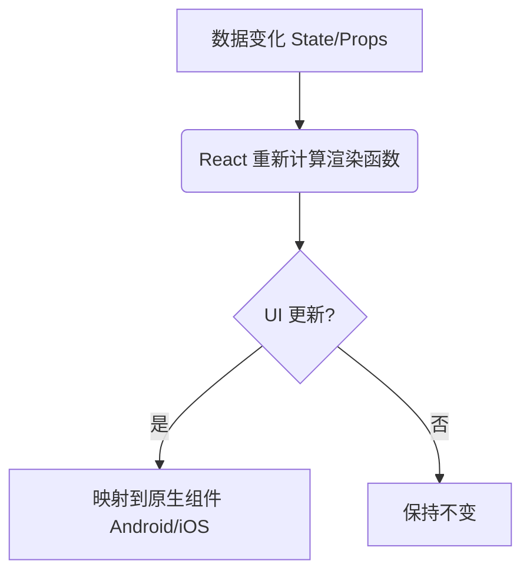
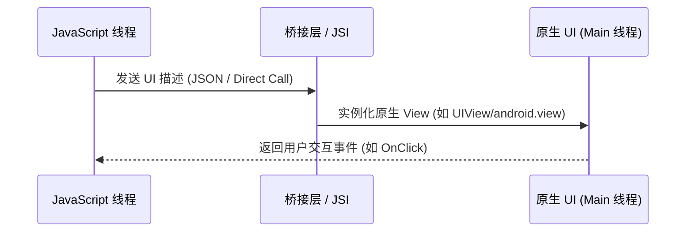
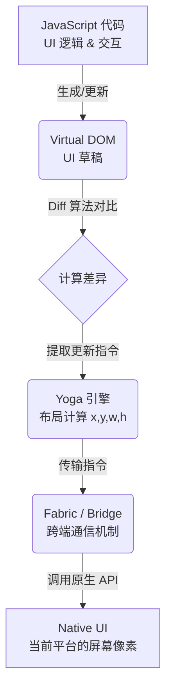

# React Native 组件核心原理详解

> [!TIP]
> **组件 (Component)** 是 React Native 开发的砖石。理解它的运作方式，能让你从“写代码”进化为“构建系统”。

---

## 1. 引言：什么是组件？

如果你玩过**乐高积木**，你就已经理解了组件的核心思想。

在 React Native 中，每一个 UI 界面（如按钮、文字、输入框）都是一个组件。
- **独立性**：每个积木（组件）都有自己的形状和功能。
- **可复用性**：一个“轮子”组件可以用在车上，也可以用在飞机上。
- **可组合性**：通过组合简单的积木，可以搭出极其复杂的城堡。

---

## 2. 声明式 UI：告诉 React “长什么样”

传统的原生开发（iOS/Android）通常是**命令式**的：
> “找到那个按钮，改变它的背颜色，然后把它禁用。”

React Native 是**声明式**的：
> “当 `isLoading` 是 `true` 时，这个按钮应该是灰色的且不可点击。”

### 核心逻辑流


---

## 3. 组件的“基因”与“记忆”：Props & State

这是组件原理中最关键的两个概念：

| 概念 | 类喻 | 说明 |
| :--- | :--- | :--- |
| **Props (属性)** | **基因** | 由外部传给组件的数据，组件内部**不可修改**（只读）。 |
| **State (状态)** | **记忆** | 组件内部私有的数据，可以**随时间改变**（可写）。 |

**一句话总结**：Props 决定了组件“出生”时的样子，State 决定了组件在“生命过程中”的变化。

### 代码演示：Props 与 State 的结合

下面的代码展示了一个简单的点赞按钮。它接收来自父组件的 `title` (Props) 作为不可变的初始基因，同时维护自己的 `likes` (State) 作为随点击改变的记忆：

```tsx
import React, { useState } from 'react';
import { View, Text, TouchableOpacity, StyleSheet } from 'react-native';

// 这里的 title 就是 Props (基因)，由外部传入，不可被内部修改
const LikeButton = ({ title }) => {
  // 这里的 likes 就是 State (记忆)，组件内部私有，可以修改
  const [likes, setLikes] = useState(0);

  return (
    <View style={styles.container}>
      {/* 使用 Props 展示外部传入的标题 */}
      <Text style={styles.title}>{title}</Text>
      
      {/* 点击时触发 setLikes，更新 State 记忆 */}
      <TouchableOpacity 
        style={styles.button}
        onPress={() => setLikes(likes + 1)}
      >
        <Text style={styles.buttonText}>👍 点赞 ({likes})</Text>
      </TouchableOpacity>
    </View>
  );
};

const styles = StyleSheet.create({
  container: { padding: 16, alignItems: 'center' },
  title: { fontSize: 18, fontWeight: 'bold', marginBottom: 12 },
  button: { backgroundColor: '#007AFF', padding: 10, borderRadius: 8 },
  buttonText: { color: 'white', fontSize: 16 }
});

export default LikeButton;
```

---

## 4. 魔法发生的底层：渲染原理

### 4.1 虚拟 DOM (Virtual DOM)
当 State 改变时，React 不会立刻去刷新手机屏幕。它先在内存里画一个“草稿”（虚拟 DOM），然后对比新旧草稿的差异（Diff 算法），最后只把**变化的部分**告诉系统。

### 4.2 渲染桥接 (Rendering Bridge)
React Native 的神奇之处在于它不使用 HTML。你的 JavaScript 组件最终会变成真正的原生控件：



---

## 5. 架构演进：从“大桥”到“瞬间移动”

React Native 正在经历一场技术革命。

### 旧架构 (Legacy Bridge)
想象一条拥挤的独木桥。JS 想要通知原生端更新 UI，必须把信息打包成 JSON 字符串，排队走过桥。这就像在早高峰过江，会有延迟。

### 新架构 (Fabric & JSI)
这是目前的尖端技术。JS 和原生端现在可以直接共享内存，不再需要“打包过桥”。
- **Fabric**：新的渲染引擎，更流畅，支持同步渲染。
- **JSI**：像瞬移一样，JS 可以直接调用原生的函数。


*(图中展示了从传统的“JSON 数据包传送带”进化到“直接光纤连接 JSI”的过程)*

---

## 6. 组件的生命周期 (Hooks)

在现代 React Native 开发中，组件拥有自己的“生老病死”。我们使用 **Hooks** 来掌控组件的生命周期：

- `useState`：给组件分配一个“记忆抽屉”，保存它的状态数据。
- `useEffect`：监听生命周期节点并处理“副作用”（如：当组件加载时去网络请求数据、注册监听事件等）。

### 生命周期示意图
```mermaid
graph LR
    Start([组件挂载 Mount]) ==> Update([状态更新 Update])
    Update -.-> |State/Props 改变| Update
    Update ==> End([组件卸载 Unmount])
    
    subgraph "useEffect 的运行时机"
        Start --> Effect[执行 Setup (如发请求)]
        Update --> Cleanup[执行 Cleanup (如清除定时器)]
        Cleanup --> Effect
        End --> CleanupFinal[最后执行一次 Cleanup]
    end
```
> [!TIP]
> **时刻记得清理！** 通过在 `useEffect` 中返回一个清理函数（Cleanup），可以有效避免组件卸载后仍然执行定时器或保留旧的事件监听而导致的内存泄漏。

---

## 7. 核心运作流程详解

将上述原理串联起来，一个 React Native 组件从渲染到显示的完整流程如下：

### 核心流程图解



### 7.1 JavaScript：逻辑处理与 UI “草稿”
所有的业务代码运行在 **JavaScript 线程**（通常由 Hermes 引擎执行）。
- **生成草稿**：当你编写 JSX 时，实质上是在描述 UI 的状态。每次 `setState` 或 Props 改变，JavaScript 都会重新运行组件函数，生成一套新的 **React Element Tree**。
- **轻量高效**：这些只是普通的 JS 对象，创建速度极快，它们构成了 UI 的“虚拟草稿”。

### 7.2 Virtual DOM：高效的“找茬”专家
React 拥有高效的 **Diffing 算法**。
- **对比差异**：它会将新生成的“草稿”与当前正在显示的“旧草稿”进行对比。
- **按需更新**：如果只是按钮文字变了，React 只会记录下这个文字的变化，而不会去动整个页面。这种“只更新变化部分”的策略是 React 保持流畅的核心。

### 7.3 Yoga 引擎：跨平台的布局魔术师
虽然我们用 Flexbox（像 Web 一样）来写布局，但 iOS 和 Android 原生并不懂 Flexbox。
> [!NOTE]
> **坐标转换**：**Yoga** 是由 Meta 开发的底层 C++ 布局引擎。它负责将你的 Flexbox 样式（如 `justifyContent: 'center'`）精确计算成原生平台能理解的绝对坐标（x, y）和尺寸（width, height）。

- **性能卓越**：由于 Yoga 是用 C++ 写的跨平台引擎，它的计算速度非常快，确保了即使是长列表和复杂页面的布局也能瞬间成型。

### 7.4 Fabric/Bridge：指令的“传声筒”
最后，这些计算好的布局和更新指令需要传递给手机系统。
- **传递指令**：
    - **Legacy Bridge (旧)**：通过异步的 JSON 消息排队发送。
    - **Fabric (新)**：通过 **JSI** 直接调用原生方法，效率大幅提升。
- **原生落地**：原生渲染层收到指令后，操作真正的原生组件（如 iOS 的 `UIView` 或 Android 的 `TextView`），最终将像素点绘制在屏幕上。

### 📖 流程总结

简而言之，React Native 的运作就是一场精密的接力赛：
**JS 负责“想”出画面，React 负责“找”出变化，Yoga 负责“算”出位置，最终 Bridge/Fabric 负责把指令“交”给底层去呈现。** 这种分层架构让我们只需要专注编写业务逻辑，也能写出高性能跨端应用。

---

## 8. 总结

React Native 并不是简单地在应用里塞一个网页 (WebView)，而是通过 **JS 桥接或 JSI**，将 JavaScript 逻辑翻译成了真正的、能被手机系统原生解读的 **UI 指令**。

这种精巧的分层架构系统，让你不仅能享受 **Web 的快速迭代与声明式开发体验**，同时也能保留近乎 **原生级别的运行速度和触控反馈**。

---

> [!TIP]
> **想要进行现场演示？**
> 查阅我们的 [现场演示指南 (Live Demo Guide)](./demo_guide.md)，包含实时监听交互大桥 (Bridge Spy) 和性能监控的详细步骤。
